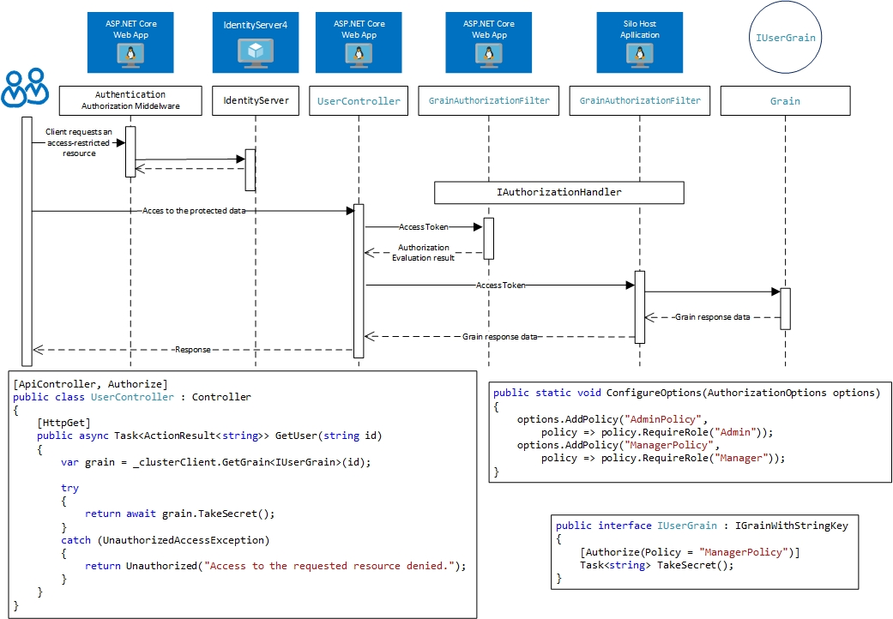

# Authorization library for Microsoft Orleans
{: .fs-9 }

The set of security packages for Microsoft Orleans 2.x/3.0.x provide the ability to use the same authorization functionality which is used in ASP.NET Core 2.x/3.x. It allows sharing IdentityServer4 (version 2 or version 3) with MS Orleans grains and any ASP.NET Core 2.x/3.x application.
{: .fs-5 .fw-300 }

The image below shows a round trip to the protected grain.

[Get started now](#getting-started){: .btn .btn-primary .fs-5 .mb-4 .mb-md-0 .mr-2 } [View it on GitHub](https://github.com/Async-Hub/Orleans.Security){: .btn .fs-5 }

---

## Getting started
### Dependencies
There are two packages: *Orleans.Security.Cluster* and *Orleans.Security.ClusterClient*. The first is for a silo host project and the seccond for an Orleans cluster client.

### Quick start

Please [see sample](https://github.com/Async-Hub/Orleans.Security/tree/master/samples) solution for more details.

---

### License

Orleans.Security is distributed by an MIT license.

### Contributing

Contributions are welcome, please contact via issue, email <admin@asynchub.org>, or any other method with the owners of this repository.